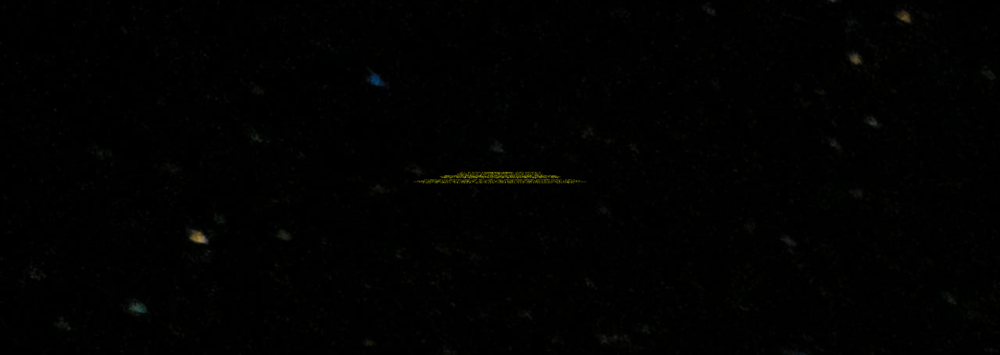

# star-wars-challenge
***
Le projet "Star Wars challenge" a pour objectif de présenter un paragraphe, avec une animation similaire à celle présente dans le film culte du même nom.

## Table des matières
1. [Utilisation](#utilisation)
2. [Technologies](#technologies)
3. [Captures d'écran](#captures-décran)
4. [Améliorations futures](#ameliorations-futures)

### Utilisation
***
Pour utiliser l'application, suivez ces étapes :

1. Allez sur la page [star wars challenge](https://tess-mltx.github.io/star-wars-challenge/)
2. Profitez du spectacle.

### Captures d'écran
***

## Technologies
***
Liste des technologies utilisées dans le projet :
* Cette animation est faite en css.

## Améliorations futures
***
* Personalisation du design.
* Optimisation de l'animation pour la lecture du texte.
